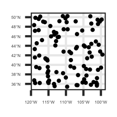

# Advantages of using Earth Engine over R for working with spatial data:

- Much faster for working with large datasets

- Don't have to save huge raster files to your hard drive

- Don't need to worry about defining projections

- Free access to hundreds (more?) of datasets in one place (> 600 as of 2018)

???

Processing happens much faster because it takes place on the cloud server and processes everything all at once

This means you don't need to actually download very large datasets

You also don't need to worry about matching projections or reprojecting your data to perform operations

Browse EE catalog all from one place

---

# Advantages of using rgee over Earth Engine code editor:

- Work with more familiar R syntax

- Integrate R functions with Earth Engine functionality

- Make nicer maps (use Earth Engine objects with sf, Tidyverse, etc.)

.pull-left[
```{r, eval = F}
point <- ee$Geometry$Point(-122.262, 37.8719)

start <- ee$Date('2014-06-01')
finish <- ee$Date('2014-10-01')

filteredCollection <- ee$ImageCollection('LANDSAT/LC08/C01/T1')$
  filter(ee$filterBounds(point))$
  filter(ee$filterDate(start, finish))
```
]

.pull-right[
```{js, eval = F}
var point = ee.Geometry.Point(-122.262, 37.8719);
var start = ee.Date('2014-06-01');
var finish = ee.Date('2014-10-01');
var filteredCollection = ee.ImageCollection('LANDSAT/LC08/C01/T1')
  .filterBounds(point)
  .filterDate(start, finish);
```
]

???

While R syntax is very similar to javascript, you might find it easier just to write in the same coding language you're familiar with

Rgee uses similar functions to EE, but you can also work with R functions, use the Tidyverse, etc. So you can integrate processes you would normally write in R, like loops, functions, dataframe/vector operations, etc. with EE data.

Because you can integrate those functions, it's easy to convert EE objects to objects you can use and plot in R, like sf

---

# Easily convert feature collections to sf

```{r, echo = F, message = F, warning = F, results = F}

library(rgee)
library(tidyverse)
library(sf)

ee_Initialize(user = 'j.newedi@gmail.com', drive = TRUE)

```


```{r, message = F}

# Define geometry
region <- ee$Geometry$Rectangle(-119.224, 34.669, -99.536, 50.064)

# Create random points
ee_randomPoints <- ee$FeatureCollection$randomPoints(region, 100)

# Convert to sf
sf_randomPoints <- ee_as_sf(ee_randomPoints)

```

```{r, eval = F}

# Plot
ggplot() + geom_sf(data = sf_randomPoints) + theme_bw()

```

.center[]

